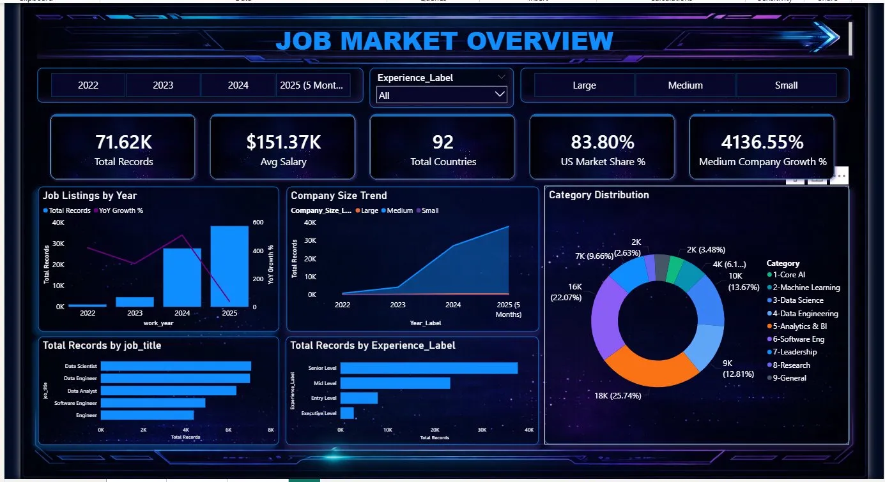
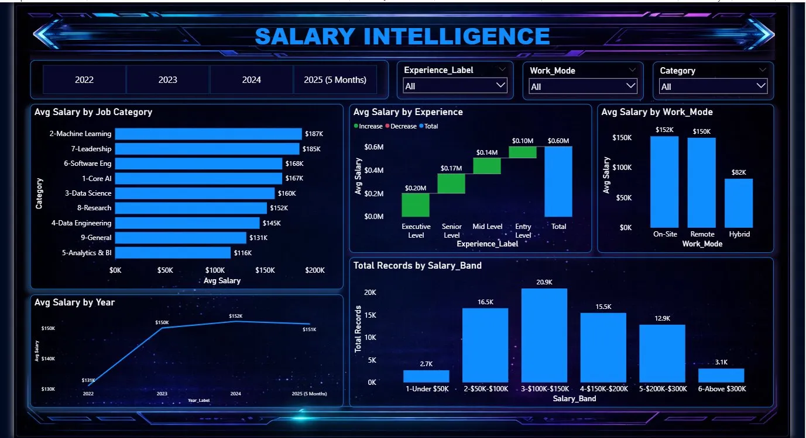
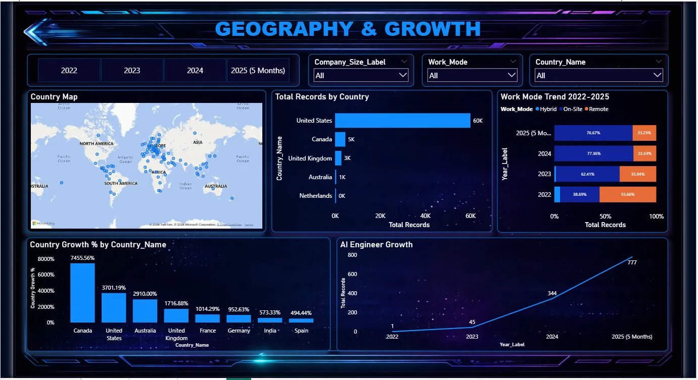

# 📊 Global AI Job Market Analysis — Power BI Dashboard

## 🚀 Project Overview
This project presents a 3-page interactive Power BI dashboard analyzing the
Global AI Job Market from 2022 to 2025. It covers job trends, salary intelligence,
company growth patterns, and geographic distribution across 92 countries.

The dashboard helps in:
- Understanding global AI job listing trends by year
- Analyzing salary distribution by role, experience, and work mode
- Tracking company size growth over time
- Exploring geographic opportunities and country-wise growth

---

## 🎯 Problem Statement
The AI job market is growing at an unprecedented pace, but insights are scattered.
This dashboard brings everything together to help job seekers, recruiters,
and analysts make data-driven decisions about the AI industry.

---

## 📊 Key Metrics (from Dashboard)
| Metric | Value |
|--------|-------|
| 📋 Total Records | 71,620 |
| 💰 Avg Salary | $151.37K |
| 🌍 Total Countries | 92 |
| 🇺🇸 US Market Share | 83.80% |
| 📈 Medium Company Growth % | 4136.55% |
| 🛒 Average Order Value (AOV) | $458.61 |

---

## 📈 Key Insights

### Page 1 — Job Market Overview
- **Data Scientist** is the most listed job title followed by Data Engineer and Data Analyst
- **Senior Level** roles dominate job listings across all years
- **Analytics & BI** (25.74%) and **Data Science** (22.07%) are the top job categories
- Job listings grew sharply in **2024** with continued growth in 2025
- **Large companies** lead hiring, with Medium companies growing fastest at 4136.55%

### Page 2 — Salary Intelligence
- **Machine Learning** roles offer the highest avg salary at **$187K**
- **Leadership** roles follow at **$185K**, Software Engineering at **$168K**
- **On-Site** and **Remote** work modes both average around **$150–152K**
- **Hybrid** roles average lower at **$82K**
- Most jobs fall in the **$100K–$150K salary band** (20.9K records)
- Avg salary grew from **$131K (2022)** to **$152K (2024)**

### Page 3 — Geography & Growth
- **United States** dominates with **60K+ job listings** out of 92 countries
- **Canada** leads country growth at **7455.56%**, followed by US at **3701.19%**
- **India** has a growth rate of **573.33%** showing rapid expansion
- **Remote work** declined from **55.66% (2022)** to **23.23% (2025)**
- **Hybrid work** is rising, now at **76.67% in 2025**
- **AI Engineer** role grew from just **1 record (2022)** to **777 records (2025)**

---

## 🖼️ Dashboard Preview

### Page 1 — Job Market Overview

### Page 2 — Salary Intelligence

### Page 3 — Geography & Growth

---

## 📂 Dataset
- **File:** `salaries.csv`
- **Period:** 2022 – 2025 (5 Months)
- **Records:** 71,620 global AI job listings
- **Coverage:** 92 countries

---

## 🔧 Tools Used
- **Microsoft Power BI** — 3-page interactive dashboard
- **DAX** — Calculated measures, KPIs, YoY growth metrics
- **Power Query** — Data cleaning and transformation

---

## 📊 Dashboard Features
- **KPI Cards** — Total Records, Avg Salary, Countries, US Market Share, Company Growth
- **Year Filter Buttons** — 2022, 2023, 2024, 2025
- **Experience, Work Mode, Category, Company Size Slicers**
- **Job Listings by Year** — Dual axis bar + line chart with YoY Growth %
- **Company Size Trend** — Large vs Medium vs Small over time
- **Category Distribution** — Donut chart across 9 job categories
- **Avg Salary by Job Category** — Horizontal bar chart
- **Avg Salary by Experience** — Waterfall chart
- **Avg Salary by Work Mode** — On-Site vs Remote vs Hybrid
- **Salary Band Distribution** — 6 salary brackets
- **Country Map** — Global geospatial bubble map
- **Country Growth %** — Bar chart by country
- **Work Mode Trend 2022–2025** — Stacked bar chart
- **AI Engineer Growth** — Line chart showing explosive role growth

---

## 🏆 Hackathon Project
Built during a data analytics hackathon to solve real-world AI industry insights problems.

---

## 👤 Author
**Sarthak Ranjan Nayak**
